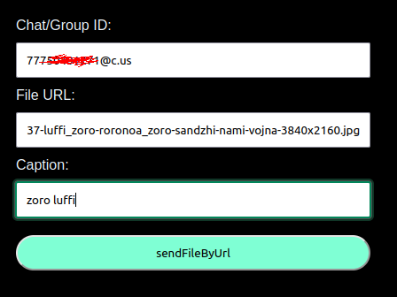

#  GREEN-API

This project is a Go web application for sending files via the WhatsApp API.

## Technologies

- Go
- HTML
- Green API WhatsApp

## Installation
1. Clone the repository: `git clone <repository_url>`
2. Navigate to the project directory: `cd green-api`
3. Run Locally with makefile: ```go run cmd/main.go```
4. And go to the web page: `http://localhost:8088`

## Screens

1. 
2. 
3. 
4. 